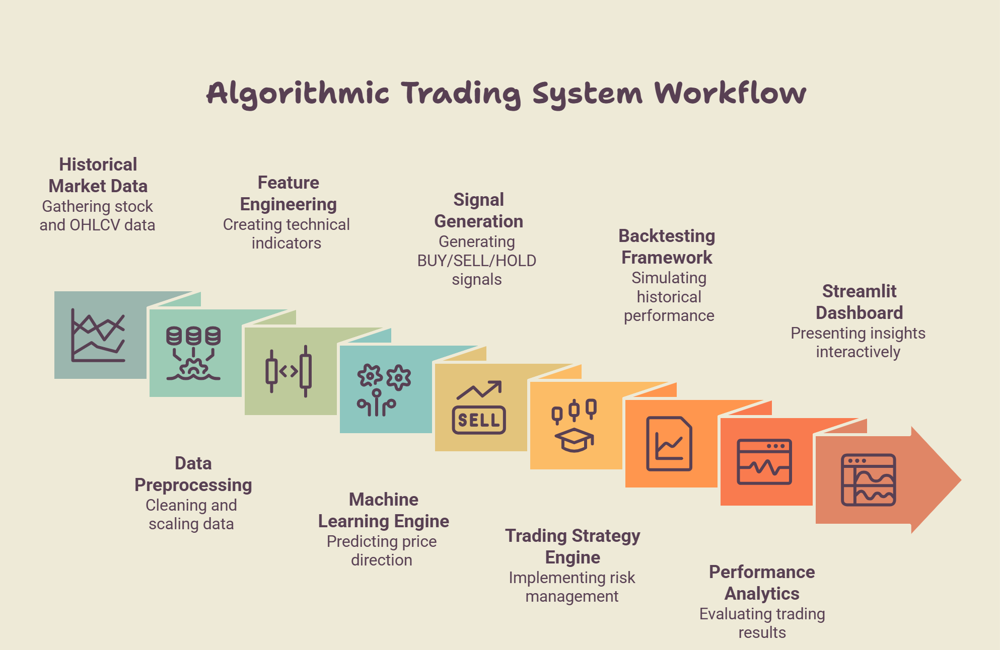
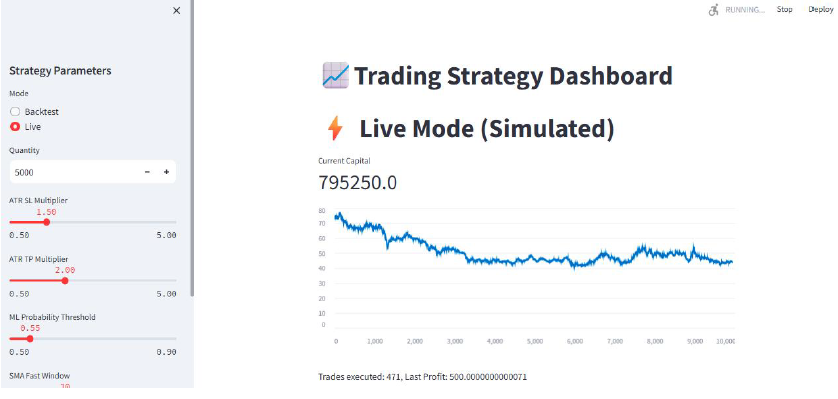
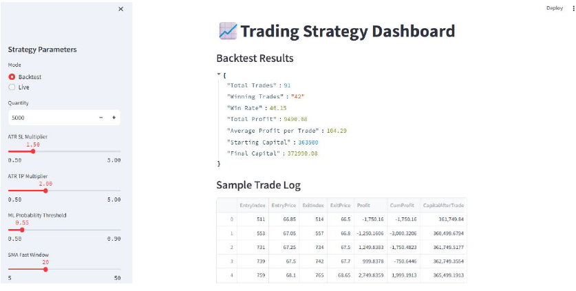
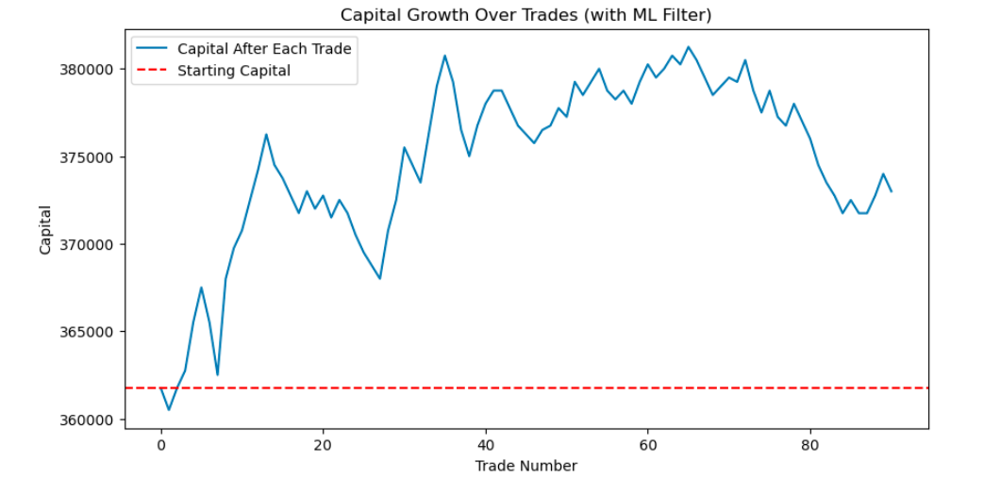
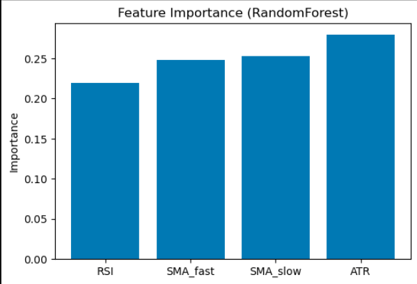
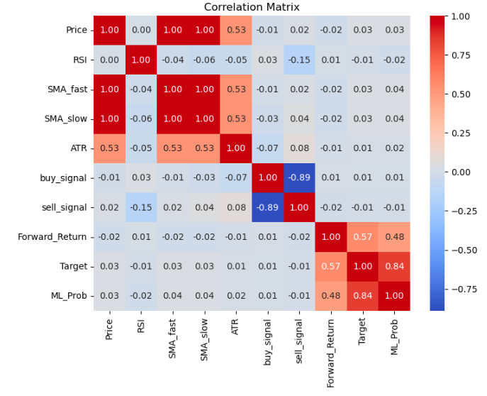

# 📈 Algorithmic Trading & Backtesting System

Machine Learning Driven Trading Platform using Python, RSI, SMA, ATR, Random Forest and Streamlit Dashboard.
## Overview

An end-to-end machine learning driven algorithmic trading platform that analyzes historical market data, generates trading signals using technical indicators and machine learning models, performs backtesting, and visualizes performance through an interactive dashboard.

---

## Features

- Historical Market Data Analysis
- RSI, SMA, ATR Indicators
- ML-based Price Direction Prediction
- Buy/Sell Signal Generation
- Backtesting Engine
- Performance Analytics
- Interactive Dashboard

---

## System Architecture

---

## Key Results

- Initial Capital: ₹3.63 Lakh
- Final Capital: ₹3.72 Lakh
- Net Profit: ₹9,490
- Total Trades Executed: 91
- Win Rate: 46.15%
- Average Profit Per Trade: ₹104

---

## Screenshots

### Live Trading Dashboard

### Backtesting Dashboard

### Equity Curve

### Trading Strategy

### Performance Metrics

---

## Tech Stack

Python

Pandas

NumPy

Scikit-Learn

Streamlit

Plotly

---

## Installation

git clone https://github.com/Mahak154/algorithmic-trading-hft.git

cd algorithmic-trading-hft

pip install -r requirements.txt

python src/main.py

## Project Structure

data/            -> Historical market datasets

src/             -> Trading system source code

screenshots/     -> Dashboard and result images

reports/         -> Power BI Dashboard and Report

## Future Improvements

- Live Market Data Integration
- Portfolio Optimization
- AI Trading Assistant
- Cloud Deployment
